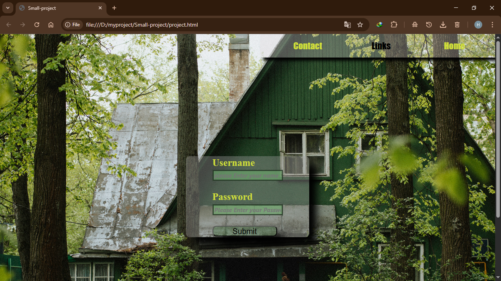

# 🌐 Small Project – Stylish Login Page with Navbar & Background

> 💡 A fully styled front-end login form with a modern top navigation bar, dynamic hover effects, and responsive layout — made with 💚 by [Hazem](https://github.com/your-username)

---

## ✨ Preview

  

---

## 🎯 Project Overview

This project is a clean, minimalist front-end web page built using only HTML and CSS. It contains a login form positioned centrally with aesthetic UI elements, a transparent top-right navigation bar, and a full-page background image for immersive visual experience.

---

## 🔥 Features Breakdown

| Feature | Description |
|--------|-------------|
| 🌌 **Full-Page Background** | A responsive, centered background image using `background-size: cover` |
| 🧭 **Navigation Bar** | Fixed top-right, styled with transparent background, shadow, and Flexbox |
| 🖊️ **Hover Effects** | Smooth transitions on buttons and links for better UX |
| 🔐 **Login Form** | Clean input fields with border styling, required fields, and password validation (`minlength`, `maxlength`) |
| 🎨 **Custom Styling** | Fonts, sizes, positioning, colors—all tailored for a modern feel |
| 📱 **Responsive Layout** | Flexbox used for adaptability across screens |

---

## 🛠 Tech Stack

- **HTML5**
- **CSS3 (Flexbox)**
- No JavaScript involved (pure static project)

---

## 🚀 Live Demo

> 🔗 **[View the Live Project](https://your-username.github.io/small-project/)**  
*(Replace `your-username` with your GitHub username)*

---

## 📂 Folder Structure

SMALL-project/
│
├── index.html
├── project.css
├── screenshot.png
└── assets/ (if you store images)
## 🧠 Future Improvements

Here are some ideas to expand or enhance the project in the future:

- 📱 **Full Mobile Responsiveness**
  - Add media queries to make the layout fully adaptive across phones and tablets.

- 🧪 **Client-side Form Validation**
  - Use JavaScript to validate user input in real-time before submission.

- 🎨 **Dark/Light Theme Toggle**
  - Let users switch between light and dark modes using a toggle button.

- 🌍 **Multi-language Support**
  - Add localization for Arabic/English users using i18n techniques.

- 💾 **Backend Integration**
  - Connect the form to a backend API using Node.js or Firebase to handle real login requests.

- 📊 **Analytics Tracking**
  - Use Google Analytics or a simple tracking system to log user interactions.

- 🖼️ **Improved Image Optimization**
  - Use webp formats and lazy loading for faster performance.

- 💡 **Accessibility Improvements**
  - Ensure ARIA roles, proper contrast, keyboard navigation, and screen reader support.

- ✨ **Animations & Transitions**
  - Smooth fade-ins, slide-ins, or subtle animations on load and interactions.

- 🔐 **Password Visibility Toggle**
  - Let users toggle visibility of their password using a simple eye icon.
 
  - 
## ✍️ Author

This is my **first real front-end project**, and I'm just getting started in web development.

I'm learning HTML, CSS, and soon moving on to **JavaScript, React, and Node.js**.  
My goal is to become a **remote Back-end Developer** and work internationally — 

> This is just the beginning.  
> **The next projects will be cleaner, smarter, and stronger. Stay tuned. 🔥**

